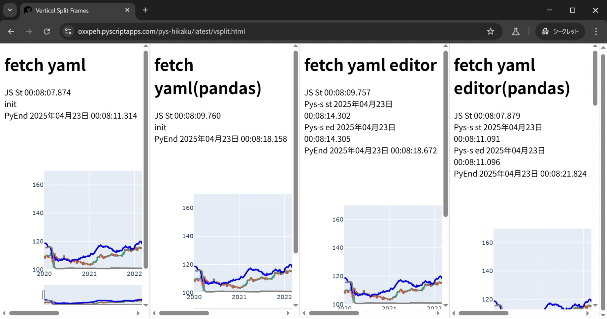

# PyScript Editor動作できたのでちょっと比較
他で作ったyamlで図データ取得してplotlyで描画するやつで比較  
GithubpagesでCORP関連のヘッダ追加設定できてないのでeditor動作しない…
## ファィル
・ pys_fetch_yaml.html -> 追加とかなし  
・ pys_fetch_yamlp.html -> 追加でpandasインポート  
・ pys_fetch_yaml_e.html -> py_editorで実行  
・ pys_fetch_yaml_ep.html -> py_editorで実行 追加でpandasインポート  
以下は同時に開いて速度比較用  
・ vsplit.html -> pyscripot 4種比較※[pyscriptapps.com](https://oxxpeh.pyscriptapps.com/pys-hikaku/latest/vsplit.html)で動作    
・ vsplit2.html -> pyscript使用(editorなし)とjavascriptのみ  
    [Githubpages](https://oxxpeh.pyscriptapps.com/pys-hikaku/latest/vsplit2.html)と[pyscriptapps.com](https://oxxpeh.pyscriptapps.com/pys-hikaku/latest/vsplit2.html)で動作
・ pys_hikaku.jpg -> 4種比較の結果画面  
・ [pys_hikau.mp4](./pys_hikaku.mp4)  -> 4種比較の動作動画 (2MB)  
## その他
・結果画面  
  
